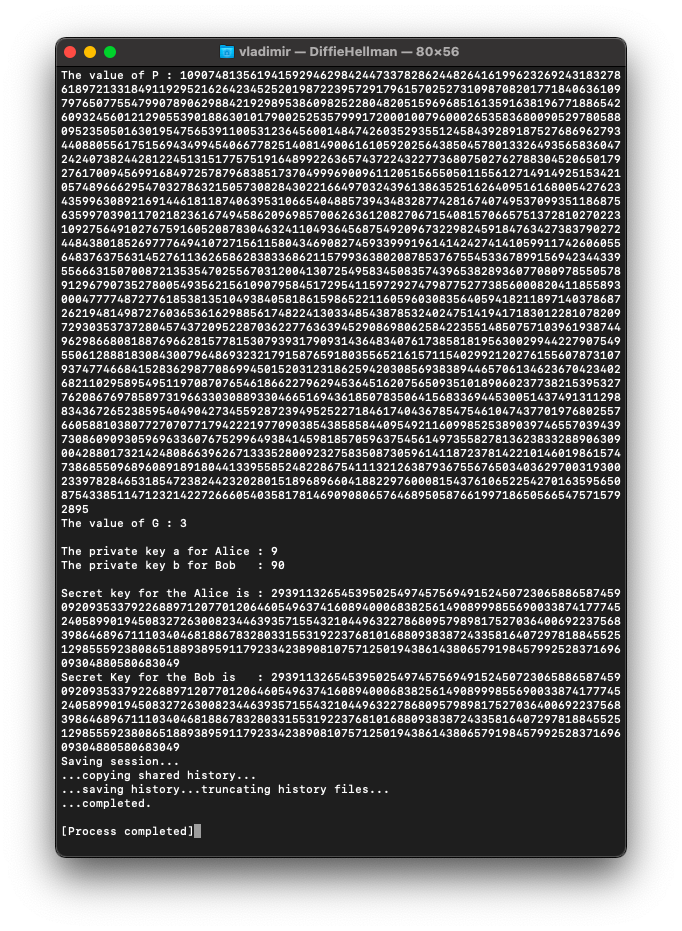
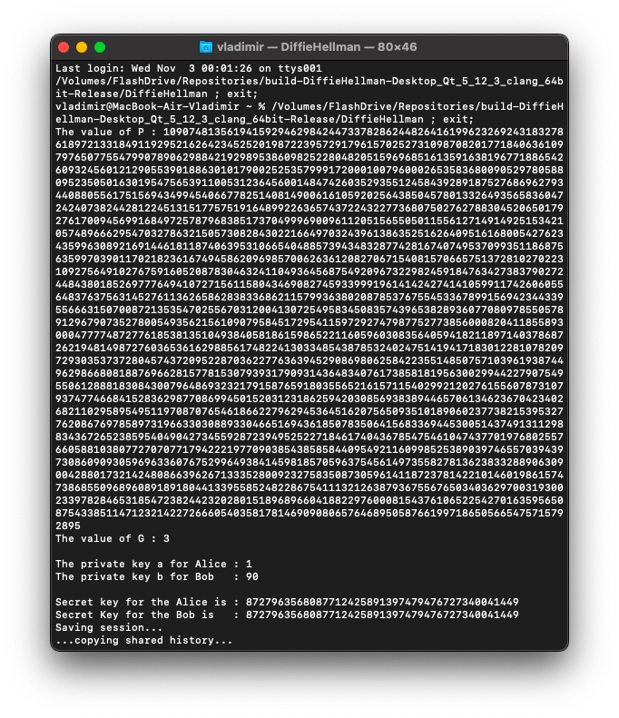
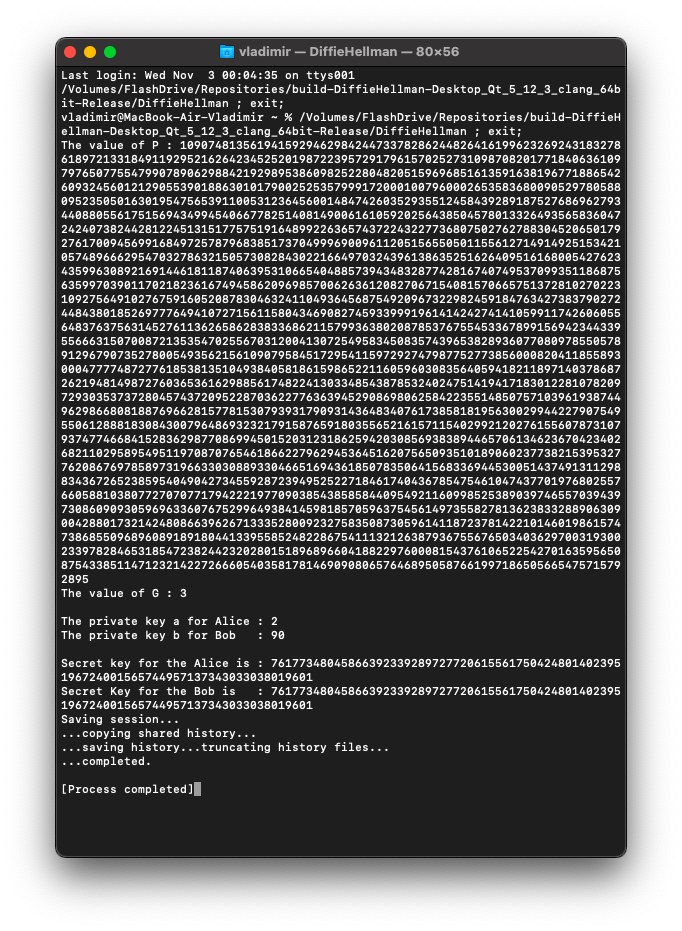

# DiffieHellman [](https://github.com/Red-company/RES_Implementation/blob/main/LICENSE.md)



## What is it?

This is an implementation of DiifieHellman key exchange protocol that works with very long inegers(2468 chars long, look at the screenshot that is placed above this text or below). You also can find an example file at this repository with it's description. It is a part of [RedLibrary](https://github.com/Red-company/RedLibrary).

## WARNING:
This repository was the first version of DiffieHellman, for a newer one check [RedLibrary](https://github.com/Red-company/RedLibrary).

## How it works?

The simpliest way to describe how it works is to draw that, so, I did that, here it is:

```
  _____     _____
 /     \   /     \
|   m   | |   m   | - 1 Step. We have the same values at the beginning.
 \_____/   \_____/
    |         |
  __|__     __|__
 /     \   /     \
|  m+a  | |  m+b  | - 2 Step. We're mixing them with our secret keys.
 \_____/   \_____/
    |         |
  __|__     __|__
 /     \   /     \
|   ma  | |   mb  | - 3 Step. We got mixed keys.
 \_____/| |\_____/
        \ / 
  _____  X  _____
 /     \/ \/     \
|   mb  | |   mb  | - 4 Step. We're exchanging them.
 \_____/   \_____/
    |         |
  __|__     __|__
 /     \   /     \
| mb+a  | | ma+b  | - 5 Step. Mixing again with secret keys.
 \_____/   \_____/
    |         |
  __|__     __|__
 /     \   /     \
|  mab  | |  mab  | - 6 Step. We got the same keys.
 \_____/   \_____/
```

So, you have successfully traced the 'fingered-edition' DiffieHellman, but we're here for something much more difficult and interesting, you're here for education, not for code, doesn't it? ;) <br/><br/>

I'm joking, it's 'safed' by MIT Licence, it's fully your's. <br/><br/>

Let's get back to the funny math. Let's describe it by steps I drew before:

* 1.)   It's like 0 position, needn't to describe it. Just getting a 'Prime number', base number(it's named 'g') and getting some random keys.
```C
P = -1; // Just getting the max value.
g = 3;  // Base number, in fact, it's better to use 2.
```
Yeah, we're working with exponent, because it's 'easy' to calculate it but it's difficult to get sqrt from that.
* 2.-3.) We're calculating our public keys with the following formulas:
```C
A = g**a mod P // For Alice.
B = g**b mod P // For Bob.
```

* 4.) Next, we're exchanging them, and the crucial thing in DiffieHellman is that you're exchanging something, that it's impossible to calculate sqrt from(or at least toooooooooo difficult, as difficult that useless):
```C
Est. chance of getting the one we need = lim[x->0]
```

* 5.-6.) We're using our secret key again to get synced keypair, and yeah, exponent again:
```C
S1 = B**a mod P // For Alice.
S2 = A**b mod P // For Bob.

S1 = S2
```

Congratulations! We did that! Now, you understand how it works, don't you want to see some examples? Look at the screenshots below.<br/>





## Where to use?

As you could understand, it can be used everywhere you need a secure channel(server-client applications for example), literally everywhere.

## How to make a channel in client-server application?

Good question, not difficult in fact:

* 1.) We're getting the same keys.(Full DiffieHellman)
* 2.) Now, we have the same keys. We need to get an encrypted channel, how to do that? My answers are here: <br/>
** 1.) [AES standard](https://github.com/vladimirrogozin/AES_Implementation). <br/>
** 2.) [RES standard (mine one)](https://github.com/Red-company/RES_Implementation). <br/>
You can use DH shared key as a key or to make it x2 longer with [my simple encryption algorithm(Va1)](https://github.com/vladimirrogozin/Va1) or to get a hash, and cut/expand it to the length you need([Sha256](https://github.com/vladimirrogozin/Sha256)).

## Notes:

* Prime number 2568 chars long)
* You need to have boost lib installed to work with this repository.
* It's rather fast.
* If you need ypu can make the Prime number longer, but before that you'll have to make a new integer type.

##
All material in this repository is in the public domain.
